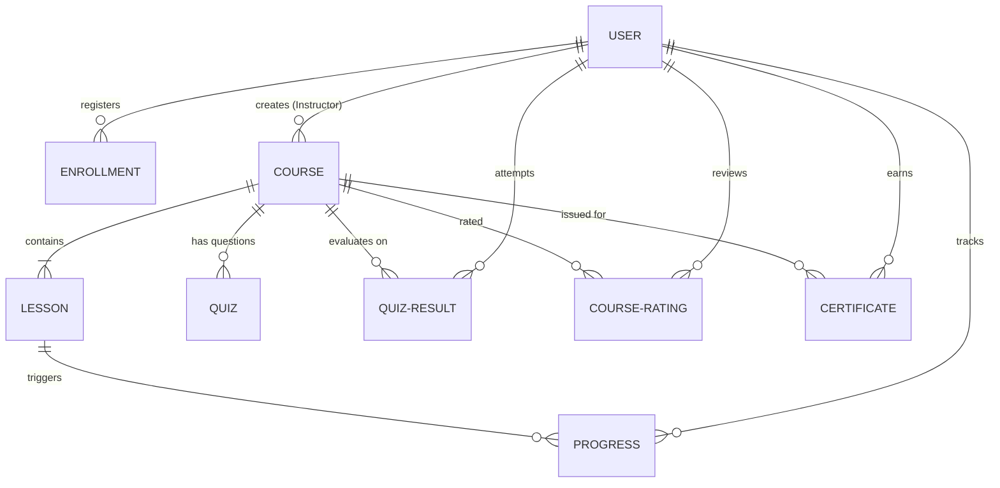

# Learnify: A Full-Stack Learning Management System (LMS)
## Technical Project Literature & System Documentation

Learnify is a modern, responsive, and secure Learning Management System (LMS) designed to facilitate online learning and course management. It features a robust multi-role portal supporting **Students**, **Instructors**, and **Administrators**, and incorporates payment processing, interactive quizzes, progress tracking, and automated certification.

---

## 1. Project Abstract & Objectives
Traditional educational systems are shifting towards digital models requiring robust, interactive, and user-centric learning environments. **Learnify** is built to bridge the gap between students, educators, and system administrators by offering:
* **Interactive Learning Paths**: Course playlists, structured lessons, progress indicators, and self-assessment quizzes.
* **Role-Based Workspaces**: Tailored dashboards that show relevant progress, analytics, and content creation tools.
* **E-Commerce and Monetization**: Payment processing enabling seamless course acquisition.
* **Automated Credentialing**: Instant, cryptographically generated completion certificates.
* **Modern Design Language**: Responsive UI with dynamic dark/light mode toggles, and seamless interactive cards.

---

## 2. Technology Stack

| Layer | Technology | Purpose |
| :--- | :--- | :--- |
| **Frontend** | React (v18+) | Core library for modular component-based user interfaces. |
| **Build Tool** | Vite | Ultra-fast bundling, hot module replacement (HMR), and developer environment. |
| **Styling** | Vanilla CSS | Custom utility tokens, glassmorphism aesthetics, responsive grids, and transitions. |
| **Backend Router** | Node.js + Express.js | High-performance asynchronous REST API routing and controllers. |
| **Database** | MongoDB (NoSQL) | Flexible document storage for hierarchical course data and relational models. |
| **ODM Interface** | Mongoose | Data modeling, validation, schema hooks, and aggregation pipelines. |
| **Authentication** | JWT & BcryptJS | Stateless token-based sessions with password hashing. |
| **Security Suite** | Helmet & Express Rate Limit | API security headers, cross-origin protection, and anti-brute force throttling. |
| **Payment Gateway** | Razorpay SDK | Unified payment collection, order generation, and signature verification. |
| **File Handling** | Multer | Server-side upload handler for course thumbnails and profile avatars. |

---

## 3. Database Schema & Architecture

The system uses **MongoDB** via Mongoose schemas. Models are heavily optimized with compound indexes, virtual mappings, and DB population hooks:

### Core Database Entities:

#### A. Users (`User` Model)
* **Fields**: `name`, `email` (unique index), `password` (hashed), `phone`, `profile_image`, `role` (`student`, `instructor`, `admin`), `login_activity` (tracks IPs and devices), `settings` (email notifications).
* **Key Feature**: Stores multiple active logins to track account security.

#### B. Courses (`Course` Model)
* **Fields**: `title`, `description`, `instructor_id` (ref to User), `price`, `level` (`Beginner`, `Intermediate`, `Advanced`), `category`, `thumbnail`, `video_url` (introductory video).
* **Key Feature**: Incorporates custom virtual getters to dynamically retrieve the student enrollment count, rating count, and average course rating from related models via aggregation pipelines.

#### C. Lessons (`Lesson` Model)
* **Fields**: `course_id` (ref to Course), `title`, `content` (markdown/text description), `content_url` (attached documents), `video_url`, `lesson_order` (sorting index).

#### D. Enrollments (`Enrollment` Model)
* **Fields**: `user_id` (ref to User), `course_id` (ref to Course), `enrolled_at`.
* **Key Feature**: Implements a compound index `{ user_id: 1, course_id: 1 }` to prevent duplicate course enrollment.

#### E. Progress (`Progress` Model)
* **Fields**: `user_id`, `lesson_id` (ref to Lesson), `status` (`started`, `completed`), `updated_at`.
* **Key Feature**: Compound index ensures single tracking entry per lesson per student, allowing real-time percentage progression computation.

#### F. Quiz & Quiz Results (`Quiz` & `QuizResult` Models)
* **Quiz fields**: `course_id`, `lesson_id` (optional), `question`, `options` (array of strings), `correct_answer`, `is_final` (true if the exam determines course certification).
* **QuizResult fields**: `user_id`, `course_id`, `attempts_count`, `best_score`, `status` (`passed`, `failed`).
* **Key Feature**: Limits certification to students passing the final course exam with a required passing threshold.

#### G. Ratings & Reviews (`CourseRating` Model)
* **Fields**: `course_id`, `user_id`, `rating` (1-5 integers), `review` (text), `created_at`.
* **Key Feature**: Uses Mongo aggregate averages to compute overall course ratings dynamically.

#### H. Certificates (`Certificate` Model)
* **Fields**: `user_id`, `course_id`, `certificate_id` (unique cryptographic UUID string), `issued_at`.

---

## 4. Key Workflows & Features

### 1. Security-First Session Lifecycle
* **Authentication**: JWT is stored securely on the client side. Password hashing utilizes BcryptJS with a salt round of 10.
* **API Protection**: Helmet middleware secures headers, while `express-rate-limit` prevents Denial of Service (DoS) attacks on critical authentication endpoints.

### 2. Transaction Flow (Razorpay Integration)
1. **Order Generation**: Client triggers checkout -> Backend contacts Razorpay SDK to create an order -> Order ID and receipt are sent to the client.
2. **Payment Collection**: Client handles payment via Razorpay's checkout modal.
3. **Verification**: Payment callback triggers server-side validation. The backend hashes `razorpay_order_id + "|" + razorpay_payment_id` using the server's secret key via a `sha256` HMAC.
4. **Fulfillment**: If signatures match, an `Enrollment` record is created, granting access.

### 3. Student Progress & Certification Flow
1. **Progress Tracking**: Marking a lesson completed inserts a Progress log. Course player computes progress using:
   $$\text{Progress \%} = \left( \frac{\text{Completed Lessons}}{\text{Total Lessons}} \right) \times 100$$
2. **Examination**: Once $100\%$ lessons are completed, the Final Quiz unlocks.
3. **Certification**: Scoring a passing score triggers automated backend certificate generation. A unique UUID is saved, and a downloadable certificate modal renders.

### 4. Instructors & Admin Portals
* **Instructor Dashboard**: Controls course creation, lesson ordering, student list viewing, content updating, and revenue monitoring.
* **Admin Dashboard**: Absolute system control, enabling global user management, system-wide course reviews, enrollment oversight, and database seeding.

---

## 5. Summary of System Strengths
1. **Clean Decoupled Architecture**: Easily separate deployment of front-end (Vercel/Netlify) and back-end (Render/Heroku/AWS).
2. **NoSQL Performance**: Heavy usage of indexes and aggregation makes database lookups fast and lightweight.
3. **Intuitive Theme Engine**: Custom CSS variables facilitate instant Light/Dark mode styling shifts globally.

---

## 6. References & Bibliography

For a comprehensive list of technical and academic references supporting the designs, technologies, security measures, and database patterns implemented in this project, please see the [REFERENCES.md](file:///c:/Users/janve/OneDrive/Desktop/kvon-task/LMS_mongodb/REFERENCES.md) file.

